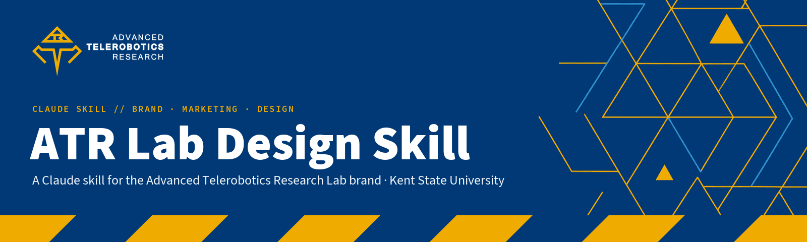
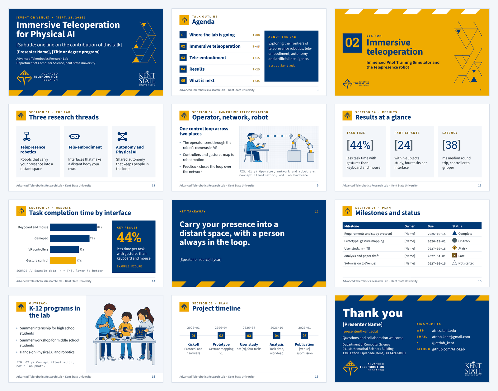
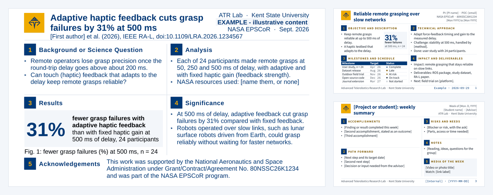
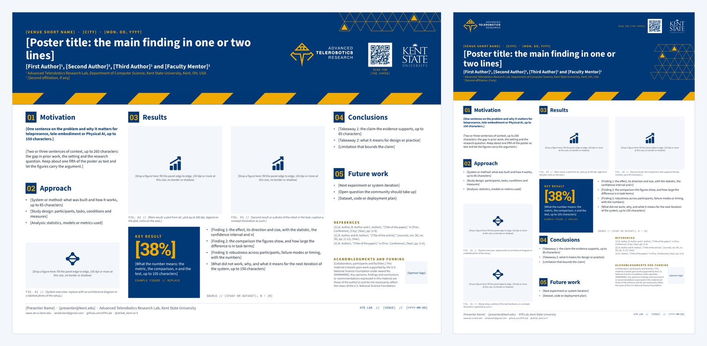
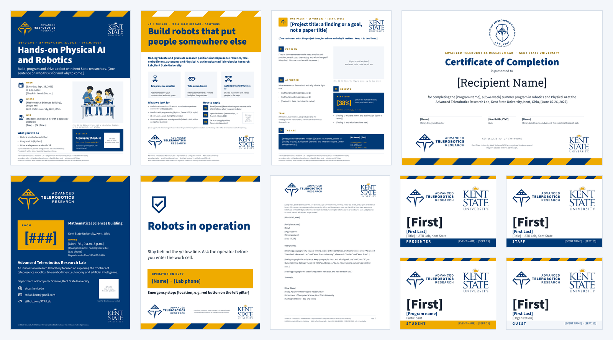
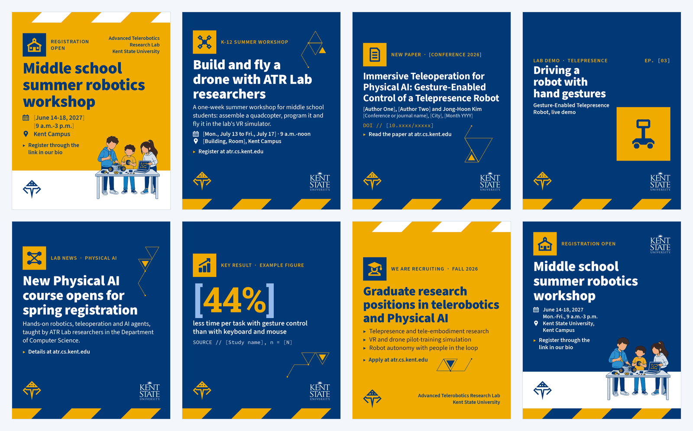
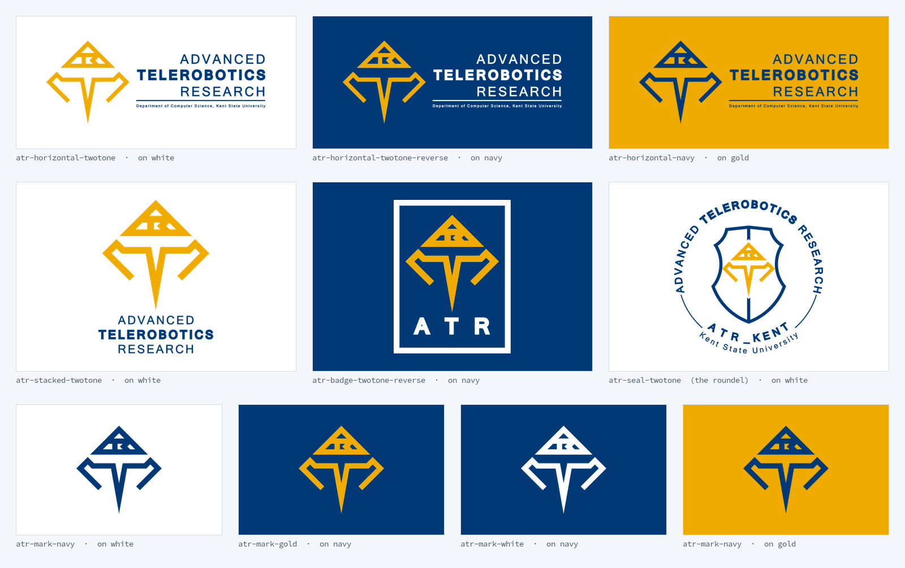
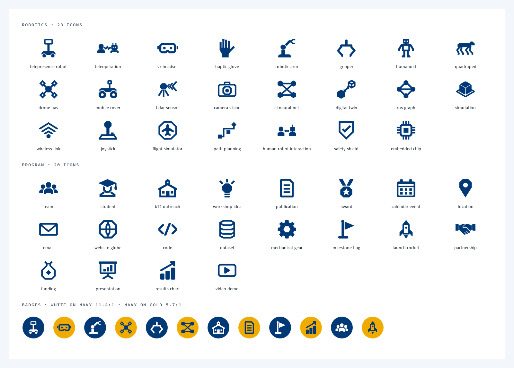
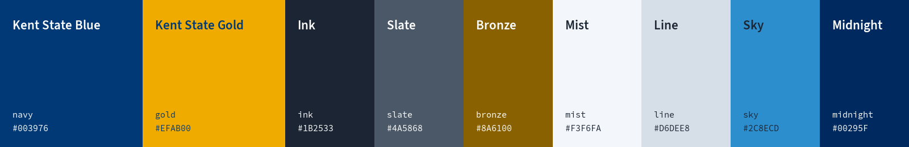

<p align="center">
  
</p>

<p align="center">
  
  
  
  
  
</p>

# ATR Lab Design Skill

**`atr-lab-design`** is a [Claude skill](https://docs.claude.com/en/docs/agents-and-tools/agent-skills/overview)
that turns Claude into the **Advanced Telerobotics Research Lab's** in-house designer, copywriter and brand checker.
Ask for a slide deck, a NASA quad chart, a research poster, a flyer, an Instagram post, a press release or a brand
review, in plain words. Claude builds it on the lab's own templates, in Kent State colors and fonts, with only
verified facts. It then checks the result before handing it over.

It covers every part of the lab's marketing and design:

- **The brand:** verified facts and naming, positioning, boilerplates, and the voice with Kent State editorial style.
- **Kent State compliance:** logo co-branding, athletics marks, trademark and merch licensing, and accessibility law.
- **The visual system:** logos (traced to vector), color and design tokens, typography, 43 custom icons, patterns,
  backgrounds and concept illustrations.
- **16 templates:** a presentation (22 layouts), quad charts (NASA format, project status, weekly summary), two
  research posters, a flyer, a one-pager, a certificate, a name badge, door signs, a letterhead, an email signature
  and five social media sizes.
- **Scripts:** a brand and accessibility linter, a contrast checker, a renderer, and builders for decks, quad charts,
  social graphics and email signatures, plus an AI icon pipeline.

> [!NOTE]
> This repository is private to the ATR-Lab organization. You need access to it (and `gh auth login` or git
> credentials) to install the skill.

## Contents

- [Install with one prompt](#install-with-one-prompt)
- [Other ways to install](#other-ways-to-install)
- [Requirements](#requirements)
- [Use it](#use-it)
- [What it makes](#what-it-makes)
- [The brand at a glance](#the-brand-at-a-glance)
- [Scripts cheat sheet](#scripts-cheat-sheet)
- [What's inside](#whats-inside)
- [Keep it current](#keep-it-current)
- [For maintainers](#for-maintainers)
- [Credits and licenses](#credits-and-licenses)

---

## Install with one prompt

Copy this into **Claude Code**, in a terminal or in the Code tab of the Claude desktop app. Claude will clone the
repository, install the skill for all your projects, set up its Python tools and check that it works.

```text
Install the ATR Lab design skill for me as a personal Claude Code skill.

1. The skill is the atr-lab-design/ folder of the private GitHub repo ATR-Lab/atr-lab-design-skill.
   Check that I'm signed in to GitHub with `gh auth status`. If I'm not, stop and ask me to run
   `gh auth login` myself. Never ask for or handle my credentials.
2. Clone it with `gh repo clone ATR-Lab/atr-lab-design-skill ~/.local/share/atr-lab-design-skill -- --depth 1`,
   or run `git -C ~/.local/share/atr-lab-design-skill pull` if that folder already exists.
   On Windows, use %LOCALAPPDATA%\atr-lab-design-skill instead.
3. Make it a personal skill: create ~/.claude/skills if needed, then symlink
   ~/.claude/skills/atr-lab-design to the atr-lab-design folder inside the clone.
   If symlinks aren't available (Windows without developer mode), copy the folder instead.
   If ~/.claude/skills/atr-lab-design already exists and isn't that symlink, ask me before replacing it.
4. Set up the skill's Python tools: create a virtual environment at atr-lab-design/.venv inside the clone
   (Python 3.12 or 3.13 preferred; 3.9+ works for everything except the icon pipeline), then
   `pip install -r scripts/requirements.txt` into it.
5. Check for LibreOffice (`soffice`) and poppler (`pdftoppm`), which the skill uses to render and check files.
   If either is missing, tell me the install command for my OS, but don't install system software yourself.
6. Ask me whether to install the brand fonts from atr-lab-design/assets/fonts/ (Source Sans 3, Roboto Slab,
   Source Code Pro) into my user font folder so I can edit the templates by hand. Only do it if I say yes.
7. Verify the install:
   - read ~/.claude/skills/atr-lab-design/SKILL.md
   - run `.venv/bin/python scripts/brand_check.py --help` and `.venv/bin/python scripts/new_deck.py --list-templates`
     from the skill folder
   Then tell me it's ready, say where it lives and how to update it, and suggest three things I could ask for.
```

When it finishes, start a new Claude Code session (skills load at startup) and ask for something, e.g. *"Make a
6-slide deck introducing our lab to visiting sponsors."*

> [!TIP]
> Working **inside this repository**? You don't need to install anything. `.claude/skills/atr-lab-design` is a
> committed link to the skill, so Claude Code loads it for any session opened here.

**Update later** with this prompt:

```text
Update my ATR Lab design skill: run `git -C ~/.local/share/atr-lab-design-skill pull`, then reinstall
atr-lab-design/scripts/requirements.txt into its .venv, and tell me what changed (git log since the last pull).
```

## Other ways to install

<details>
<summary><b>Claude Code, by hand (personal: every project)</b></summary>

```bash
gh repo clone ATR-Lab/atr-lab-design-skill ~/.local/share/atr-lab-design-skill -- --depth 1
mkdir -p ~/.claude/skills
ln -sfn ~/.local/share/atr-lab-design-skill/atr-lab-design ~/.claude/skills/atr-lab-design
cd ~/.local/share/atr-lab-design-skill/atr-lab-design
python3 -m venv .venv && .venv/bin/pip install -r scripts/requirements.txt
```

A symlink keeps the skill in sync with `git pull`. `cp -R` works too; copy again after each update.
</details>

<details>
<summary><b>Claude Code, for one project (the whole team gets it)</b></summary>

Copy the skill into the project and commit it:

```bash
mkdir -p .claude/skills
cp -R ~/.local/share/atr-lab-design-skill/atr-lab-design .claude/skills/
```

Or track this repository as a submodule and link the skill folder:

```bash
git submodule add https://github.com/ATR-Lab/atr-lab-design-skill.git vendor/atr-lab-design-skill
mkdir -p .claude/skills && ln -s ../../vendor/atr-lab-design-skill/atr-lab-design .claude/skills/atr-lab-design
```
</details>

<details>
<summary><b>Claude.ai (web and desktop chat)</b></summary>

1. Make the upload zip, with `atr-lab-design/` at the top of the archive:

   ```bash
   cd ~/.local/share/atr-lab-design-skill
   zip -r atr-lab-design.zip atr-lab-design -x '*.DS_Store' '*__pycache__*' 'atr-lab-design/.venv/*'
   ```

   Or ask Claude Code: *"Build the Claude.ai upload zip of the ATR Lab design skill in ~/Downloads."*
2. In Claude.ai, open **Settings → Capabilities**, make sure code execution is on, and upload the zip under
   **Skills**. Menu names may change.

In Claude.ai's sandbox the references, templates, linter and builders work (they need only Python). Rendering to
PNG needs LibreOffice, and making new AI imagery needs the Codex CLI; the sandbox may have neither. When a render
can't run, the skill says so and asks you to look at the file.
</details>

## Requirements

| What | Needed for | Install |
|---|---|---|
| Python 3.9+ and `atr-lab-design/scripts/requirements.txt` (python-pptx, Pillow, numpy, lxml, fontTools, matplotlib and a few more) | Everything: linting, decks, quads, social cards, figures | `python3 -m venv .venv && .venv/bin/pip install -r scripts/requirements.txt` (the icon pipeline wants 3.12 or 3.13) |
| LibreOffice and poppler | Rendering files to PNG so Claude can look at its own work | macOS `brew install --cask libreoffice && brew install poppler` · Debian/Ubuntu `apt install libreoffice poppler-utils` |
| Brand fonts (bundled) | Hand-editing the templates; renders load them automatically | Install the TTFs in `atr-lab-design/assets/fonts/`; in Google Slides they're built in |
| Codex CLI (optional) | Generating new icons, backgrounds and concept illustrations | [openai/codex](https://github.com/openai/codex), signed in. macOS `remove-bg` is optional too |

## Use it

Just ask. The skill triggers on any marketing, communications or design task for the lab, including "our lab" when
you're working in this repository. You don't have to name the skill.

| You want | Try asking |
|---|---|
| A talk or pitch deck | *"Make an 8-slide deck introducing the ATR Lab to engineers from a robotics company who might sponsor us."* |
| A NASA quad chart | *"NASA quad chart for our RA-L paper '…', DOI …, 24 participants, 31% fewer grasp failures at 500 ms, NASA EPSCoR grant 80NSSC26K1234."* |
| A research poster | *"Turn this abstract and these two figures into a 48×36 poster for IROS."* |
| A social post | *"Instagram post announcing registration for our middle school summer robotics workshop, June 14-18, 2027, 9am-3pm: image, caption and alt text."* |
| Print pieces | *"Flyer and a completion certificate for the K-12 summer camp."* · *"A door sign for the lab: robots in operation."* |
| Copy | *"LinkedIn post and a department news blurb for our HRI 2026 VendoBot paper. Don't make up results."* · *"Our 50-word boilerplate for a conference program."* |
| A brand review | *"A student made this flyer. Check it against the brand and fix it."* · *"Lint every slide deck in this folder."* |
| Brand questions | *"Can we put the Kent State logo next to ours on a T-shirt?"* · *"Which logo file goes on a navy slide?"* · *"Is gold text OK on white?"* |
| Charts and figures | *"Style this matplotlib figure for an IEEE two-column paper in lab colors."* |
| Web and digital | *"Make my email signature."* · *"Favicon and social preview for the lab website."* · *"A Zoom background."* |
| New imagery | *"We need an icon for 'haptic glove' that matches our set."* |

**What you get back.** Claude reads `SKILL.md`, then only the references the task needs. It builds from the
templates with the scripts, lints the result, renders it, looks at every page and fixes what it finds. It finishes
with:

- the deliverable
- what it checked
- a **"still needed from you"** list: facts to confirm, `[placeholders]` to fill, the official Kent State logo file
  for public pieces, and approvals

**Tips for better results:**

- **Give it the facts.** The skill only states what it can verify: the lab's public record, or what you tell it.
  Anything else stays a visible `[placeholder]`, never a guess.
- **Name the audience** (sponsors, reviewers, K-12 parents, grad applicants). Tone, layout and even the social
  template change with it.
- **Ask for a draft** when details are still missing. You'll get the piece plus the list of what to fill in.
- **Correct it once.** If a fact in the skill is out of date, say so. Then update `references/brand-foundation.md`
  (see [Keep it current](#keep-it-current)).

## What it makes

Every template follows one design system, **Hazard Gold**. It uses white or navy fields, gold label plates with
the navy ATR mark, Roboto Slab numerals and the gold hazard-stripe band on bookend edges, in exact Kent State colors,
with the academic Kent State wordmark as a separate signature.

### Presentation: 22 layouts, placeholder-driven

<p align="center"></p>

Every layout is a real PowerPoint layout with placeholders: **Home → New Slide → ATR - …**. The showcase deck
teaches each layout in its speaker notes. `scripts/new_deck.py` builds finished decks from a short JSON outline.

### Quad charts: NASA format, project status, weekly summary

<p align="center"></p>

The NASA layout follows the [GSFC quad chart guidance](https://cce-signin.gsfc.nasa.gov/online_help_docs/quadchart_help.html)
word for word:

- NASA's exact headings
- Arial 14 pt or larger, navy main text and black figure text
- the short citation and DOI under the title
- NASA's acknowledgement sentence

`scripts/quad_chart.py` builds and checks quads, including big-number callouts for single results.

### Research posters

<p align="center"></p>

### Print: flyers, one-pager, certificate, signs, letterhead, badge

<p align="center"></p>

### Social media

<p align="center"></p>

`scripts/social_card.py` renders on-brand cards and an alt-text sidecar from a short spec, at 7 platform sizes and in
9 templates. The five PowerPoint social templates are for editing by hand.

### Logos and icons

<p align="center"></p>

<p align="center"></p>

## The brand at a glance

<p align="center"></p>

- **Colors:**
  - Kent State Blue `#003976` (PMS 281) and Kent State Gold `#EFAB00` (PMS 124) lead.
  - Ink `#1B2533` for body text.
  - Bronze `#8A6100` whenever gold-family text sits on white.
  - Gold on white and white on gold fail contrast (2.0:1) and are never used for text.
- **Type:**
  - **Source Sans 3** for everything.
  - **Roboto Slab** for big numbers and quotes.
  - **Source Code Pro** for code and technical labels.
  - Slide body 18 pt, 14 pt minimum.
  - The NASA quad uses Arial, as GSFC requires.
- **Names:**
  - "Advanced Telerobotics Research Lab" on first reference, then "the lab".
  - "ATR Lab" only in display type, always with Kent State.
  - Handles: X **@atrlab_kent**, Instagram **@atr_lab**, GitHub **ATR-Lab**. `@atr_kent` does not exist.
- **Never:**
  - Kent State athletics marks (the Flash K/eagle).
  - The retired block-letter "ATR" logo.
  - The ATR and Kent State logos merged into one lockup.
  - Invented facts.
  - AI images presented as real lab photos.

The full rules are in [`SKILL.md`](atr-lab-design/SKILL.md) §1 and the 20 references.

## Scripts cheat sheet

Run from `atr-lab-design/`, with `.venv/bin/python` as `python3`:

```bash
# Lint anything: .pptx .docx .svg .html/.css images, and copy in .md/.txt
python3 scripts/brand_check.py path/to/file.pptx
python3 scripts/brand_check.py caption.txt post.md

# See what a template offers, then build a deck from a JSON outline
python3 scripts/new_deck.py --list-layouts presentation
python3 scripts/new_deck.py scripts/examples/decks/sponsor-intro.json -o ~/out/deck.pptx --render --check

# NASA / status / weekly quad chart from a spec
# (the examples keep [placeholders] on purpose; drop --allow-placeholders once yours are filled)
python3 scripts/quad_chart.py scripts/examples/quads/nasa-callout-example.json -o ~/out/quad.pptx --check --render --allow-placeholders

# Social card + alt-text sidecar
python3 scripts/social_card.py scripts/examples/social/outreach-k12.json --size portrait -o ~/out/card.png --allow-placeholders

# Contrast of any two colors (hex or token names)
python3 scripts/contrast.py gold white

# Render any Office file to PDF + PNGs with the brand fonts
scripts/render_office.sh ~/out/deck.pptx ~/out/render 150

# Outlook-safe email signature
python3 scripts/email_signature.py --name "Your Name" --title "Ph.D. student" --email "you@kent.edu" --out sig   # writes sig.html + sig.txt
```

`scripts/README.md` documents every option, exit code and limitation.

## What's inside

```
atr-lab-design/                the skill (the only folder Claude needs)
├── SKILL.md                   entry point: brand card, task router, workflows, QA gate, facts policy
├── references/                20 guides: brand-foundation, voice-and-copy, kent-state-compliance,
│                              logo-system, color, typography, graphic-elements, iconography, imagery,
│                              ai-image-pipeline, presentations, quad-charts, posters, social-media,
│                              print-and-merch, web-and-digital, pr-events-outreach,
│                              data-visualization, accessibility, qa-checklists
├── assets/
│   ├── templates/             16 templates + layout contracts (*-layouts.json) + catalog README
│   ├── logos/                 SVG + PNG lockups, favicons, avatars, Kent State working copy, logos.json
│   ├── icons/                 43 icons: svg/, png/ (navy, gold, white, ink), badges/, masters/
│   ├── illustrations/         backgrounds, concept illustrations, virtual backgrounds, platform banners
│   ├── patterns/              hazard bands, triangle lattice, chevrons, blueprint grid
│   ├── tokens/                colors.json, tokens.css/.scss, Tailwind preset, Office theme, palettes,
│   │                          atr.mplstyle + atr_plot.py for figures
│   └── fonts/                 Source Sans 3, Roboto Slab, Source Code Pro (+ licenses)
└── scripts/                   brand_check, contrast, render_office, new_deck, quad_chart,
                               social_card, email_signature, codex_image, icons/, examples/
```

The repository around it holds only this README, its images (`.github/images/`) and
`.claude/skills/atr-lab-design`, a link that loads the skill in any Claude Code session opened here.

## Keep it current

- **Facts change.** New awards, papers, people, handles and sponsors go in
  [`references/brand-foundation.md`](atr-lab-design/references/brand-foundation.md): §9 is the proof bank of
  claims with exact allowed wording, §10 holds the boilerplates, §11 the contacts. The skill won't claim anything
  that isn't there or supplied by the user.
- **Open decisions** the skill cannot make on its own are listed in
  [`references/kent-state-compliance.md`](atr-lab-design/references/kent-state-compliance.md) §19 and
  [`references/brand-foundation.md`](atr-lab-design/references/brand-foundation.md) §12. Examples: Kent State
  approval of the ATR mark, the official Kent State logo files, the director's sign-off on the boilerplates, the
  lab's own room and phone. Until they are settled the skill uses a placeholder or the safer reading.
- **After any change** to a template or reference, lint the templates:
  `scripts/brand_check.py assets/templates/ --template` should report 0 errors and 0 warnings.

## For maintainers

- [`atr-lab-design/scripts/README.md`](atr-lab-design/scripts/README.md): every script's options, exit codes and limits.
- [`atr-lab-design/assets/templates/README.md`](atr-lab-design/assets/templates/README.md): the template catalog.
- The build scripts that generated the templates and assets, the sourced research notes and the test suite are not
  needed to use the skill. They are preserved in git history at tag
  [`build-sources-2026-09-29`](https://github.com/ATR-Lab/atr-lab-design-skill/tree/build-sources-2026-09-29):
  `git checkout build-sources-2026-09-29` to regenerate or re-test.

## Credits and licenses

- **Fonts:** Source Sans 3 and Source Code Pro (Adobe, SIL Open Font License 1.1) and Roboto Slab (Apache 2.0) are
  bundled with their licenses.
- **Marks:**
  - The ATR marks are the lab's own artwork, traced without redrawing.
  - The KENT STATE UNIVERSITY wordmark is a registered trademark of Kent State University. The copy here is a working
    copy; use the [official files](https://www.kent.edu/brand/logos) for public work.
  - Neither is open-licensed.
- **Generated imagery:** the icons, backgrounds and concept illustrations were generated for the lab with the Codex
  CLI's image tool and finished by script. Every prompt is recorded in a manifest.
- **The skill's own license** is to be decided by the lab.

Font licenses are in [`atr-lab-design/assets/fonts/`](atr-lab-design/assets/fonts/).

<p align="center"><sub>Advanced Telerobotics Research Lab · Department of Computer Science · Kent State University · <a href="https://www.atr.cs.kent.edu/">www.atr.cs.kent.edu</a></sub></p>
